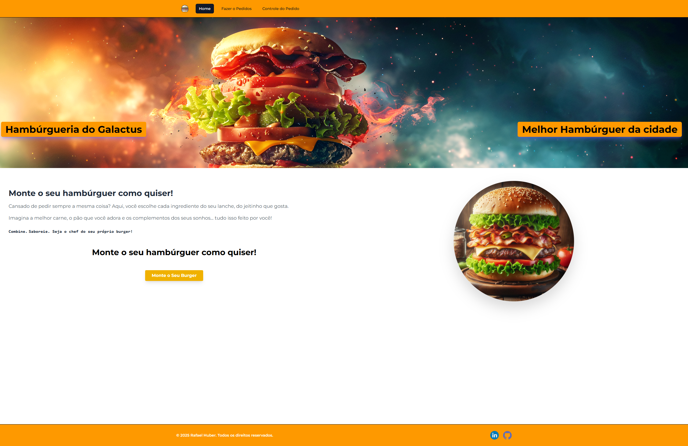
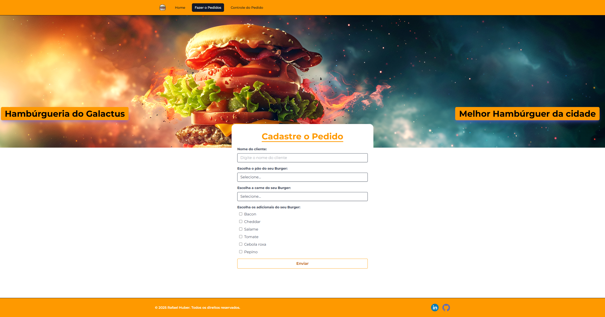
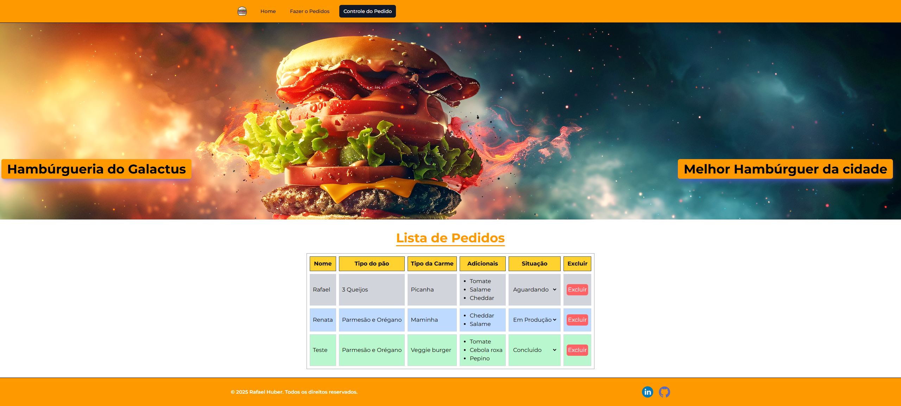

# 🍔 Vite Project

Projeto desenvolvido com **React + Vite** e estilizado com **Tailwind CSS**.

---

## 🖼️ Prévia do Projeto

### 🏠 Home



---

### 📝 Cadastro



---

### 📦 Controle de Pedidos



---

## 🚀 Tecnologias utilizadas

- [React](https://reactjs.org/)
- [Vite](https://vitejs.dev/)
- [Tailwind CSS](https://tailwindcss.com/)
- [Heroicons](https://heroicons.com/)
- [Headless UI](https://headlessui.dev/)

## 📁 Estrutura do projeto

vite-project/
├── public/
│ └── favicon.svg (ou logo)
├── src/
│ ├── assets/ # Imagens, ícones, fontes
│ ├── components/ # Componentes reutilizáveis
│ │ └── Header.jsx
│ │ └── Footer.jsx
│ │ └── Button.jsx
│ ├── pages/ # Telas principais
│ │ └── Home.jsx
│ │ └── Cadastro.jsx
│ │ └── Pedidos.jsx
│ ├── routes/ # Gerenciamento de rotas (opcional)
│ │ └── AppRoutes.jsx
│ ├── styles/ # Tailwind + custom styles
│ │ └── globals.css
│ ├── App.jsx
│ └── main.jsx
├── prints/ # Prints da UI
├── tailwind.config.js
├── postcss.config.js
├── index.html
└── package.json

## 📁 bash

```bash
# Clone o repositório
git clone https://github.com/rafaelhuber/vite-project.git

# Acesse a pasta
cd vite-project

# Instale as dependências
npm install

# Rode o projeto
npm run dev
```
