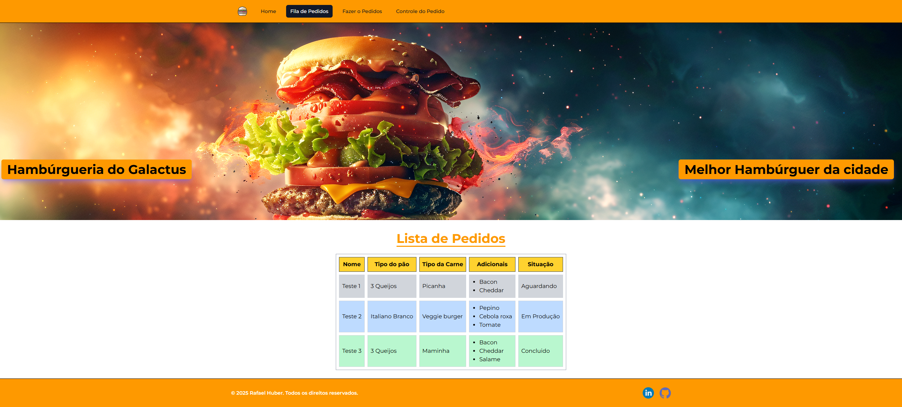

# 🍔 Vite Project — Sistema de Pedidos Interativo

Este projeto é um sistema moderno e interativo para gerenciamento de pedidos de uma hamburgueria, desenvolvido com **React** e **Vite**. A aplicação permite o cadastro, acompanhamento e controle de pedidos de forma eficiente, com uma interface simples e responsiva, ideal tanto para atendimento em balcão quanto para o controle da cozinha.

---

## 🚀 Tecnologias Utilizadas

- ⚡ [Vite](https://vitejs.dev/) — Ferramenta de build rápida e moderna para projetos front-end
- ⚛️ [React](https://reactjs.org/) — Biblioteca JavaScript para construção de interfaces
- 🎨 [Tailwind CSS](https://tailwindcss.com/) — Framework utilitário para estilização rápida e responsiva
- 🧩 [Headless UI](https://headlessui.dev/) — Componentes acessíveis sem estilos definidos
- 🖼️ [Heroicons](https://heroicons.com/) — Conjunto de ícones SVG integrados ao Tailwind

---

## 🧩 Funcionalidades Principais

- ✅ Cadastro completo de pedidos:
  - Nome do cliente
  - Escolha do pão (Ex: Tradicional, Australiano)
  - Escolha da carne (Ex: Picanha, Costela)
  - Adicionais personalizados (Ex: Bacon, Cheddar, Ovo)
- ✅ Exibição em tabela dinâmica com pedidos salvos
- ✅ Atualização de status dos pedidos:
  - “Recebido”
  - “Em preparo”
  - “Pronto”
- ✅ Alertas em tempo real para campos obrigatórios
- ✅ Exclusão individual de pedidos
- ✅ Layout responsivo e organizado com **Tailwind**
- ✅ Separação clara entre páginas, componentes e lógica
- ✅ Persistência dos dados com `localStorage`

---

## 📁 Estrutura do Projeto

```bash
vite-project/
├── public/                       # Arquivos públicos acessíveis diretamente (ex: favicon, manifest)
├── src/
│   ├── assets/                   # Recursos estáticos como imagens e ícones utilizados nos componentes
│   ├── components/               # Componentes reutilizáveis usados em várias páginas
│   │   ├── Alert.jsx             # Componente para exibir mensagens de alerta ao usuário
│   │   ├── Menus.jsx             # Menu de navegação lateral com links entre páginas
│   │   ├── TicketRow.jsx         # Representação visual de uma linha de pedido na tabela
│   │   ├── TicketTable.jsx       # Tabela que agrupa e exibe os pedidos realizados
│   │   ├── Title.jsx             # Componente reutilizável de título com estilização padrão
│   │   ├── ButtonEnviar.jsx      # Botão personalizado para submissão de formulários
│   │   ├── Footer.jsx            # Rodapé da aplicação com links e créditos
│   │   ├── Meat.jsx              # Seletor de tipo de carne no formulário de pedido
│   │   ├── OptionsAdd.jsx        # Componente de opções adicionais (ex: extras no lanche)
│   │   └── Select.jsx            # Componente estilizado de dropdown/select
│   │
│   ├── pages/                    # Páginas principais da aplicação (acessadas via rotas)
│   │   ├── Home.jsx              # Página inicial com mensagem de boas-vindas
│   │   ├── Register.jsx          # Página de criação e envio de novos pedidos
│   │   ├── Ordes.jsx             # Página para visualização e gerenciamento dos pedidos criados
│   │   ├── Header.jsx            # Cabeçalho fixo com título da página atual
│   │   └── OrderQueue.jsx        # Lista os pedidos em ordem de chegada
│   │
│   ├── router/                   # Arquivos de controle de rotas da aplicação
│   │   └── AppRoutes.jsx         # Definição das rotas e navegação entre páginas com React Router
│   │
│   ├── styles/                   # Estilizações globais e configurações do Tailwind
│   │   └── globals.css           # Estilos base e classes utilitárias globais
│   │
│   ├── services/                 # Funções auxiliares e serviços de lógica externa
│   │   └── storage.js            # Funções de manipulação do localStorage para salvar e recuperar tickets
│   │
│   ├── App.jsx                   # Componente raiz da aplicação, onde são compostos os layouts e rotas
│   └── main.jsx                  # Ponto de entrada da aplicação React, inicializa e renderiza o App
│
├── .gitignore                    # Arquivos e pastas que devem ser ignorados pelo Git
├── index.html                    # Arquivo HTML base usado pelo Vite como ponto de montagem do React
├── package.json                  # Informações do projeto, dependências e scripts de build/dev
├── vite.config.js                # Arquivo de configuração do Vite (build tool)
└── README.md                     # Documentação principal do projeto (esse arquivo)
```

````

---

## 🖼️ Capturas de Tela

### 🏠 Página Inicial

> Uma apresentação visual da hamburgueria, com o nome em destaque.


---

### 📝 Cadastro de Pedidos

> Formulário interativo com seleção de pão, carne e adicionais.


---

### 📦 Fila de Pedidos

> Exibição os pedidos realizados com status atualizado.



---

## 🛠️ Instalação e Execução Local

1. **Clone o repositório:**

```bash
git clone https://github.com/rafaelhuber/vite-project.git
cd vite-project
```

2. **Instale as dependências:**

```bash
npm install
```

3. **Inicie o servidor de desenvolvimento:**

```bash
npm run dev
```

> Acesse a aplicação em [http://localhost:5173](http://localhost:5173)

---

## 🧠 Aprendizados e Destaques Técnicos

- Manipulação de estado global com React Hooks (`useState`, `useEffect`)
- Separação clara entre **lógica** (utils) e **interface** (components/pages)
- Uso de **localStorage** para persistência de dados
- Criação de componentes acessíveis e reutilizáveis
- Navegação com **React Router**
- Uso de `map`, `filter`, `find` para manipulação funcional dos dados
- Validação de campos com exibição dinâmica de mensagens

---

## 🤝 Contribuições

Contribuições são bem-vindas! Se você tiver sugestões de melhoria, sinta-se à vontade para abrir uma **issue** ou enviar um **pull request**.

---

## 👨‍💻 Autor

**Rafael Huber**

- 🔗 [LinkedIn](https://www.linkedin.com/in/rafaelhuber)
- 📧 [rafaelhuber@email.com](mailto:rafaelhuber@email.com)
- 💼 Desenvolvedor Front-End | Apaixonado por interfaces modernas e usabilidade

---

> Este projeto foi desenvolvido com fins educacionais e de portfólio. Fique à vontade para se inspirar, adaptar e contribuir. Obrigado por visitar!

```
````
